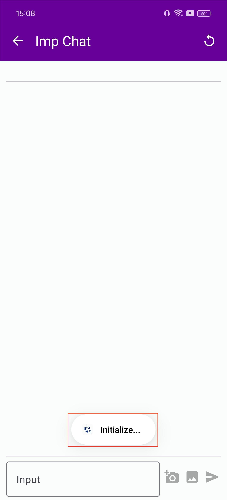

# 😈 MLC-Imp

🙌 Hi There! This is a lightweight deployment solution for Imp based on [MLC-LLM](https://github.com/mlc-ai/mlc-llm) and [MLC-MiniCPM](https://github.com/OpenBMB/mlc-MiniCPM). We deployed Imp on mobile devices📱and greatly improved the running speed during model inference.

## Model Description

⚠️ Our default version is to use Siglip with an input image size of 384x384, but considering the limitation of running speed on the mobile phone, we retrained Imp to use a Siglip version with an input image size of 196x196. (More details can be viewed in [arXiv]()).

⚠️ Note that the models run on android are quantized to 4-bit and may lose some performance.

🎉 The model weights of `imp-v1-3b-196` are on 🤗[[Huggingface](https://huggingface.co/MILVLG/imp-v1-3b/)\] (Approximately 1.9G of space occupied)

## Run on Android
### Android APK

1. Accept camera & photo permission


2. Download model: (1) Press the download button (2) Wait for the progress bar to fill up (3) Start chat 


3. Chat with Imp: (1) Wait for model initialization until "Ready to chat" pop up. (2) Upload image (3) Type and send question
    - Chat mode: Text or Vision are both support




4. Demo


### Prepare Enviroment

1. Follow https://llm.mlc.ai/docs/install/tvm.html to Install TVM Unity Compiler

2. Follow https://llm.mlc.ai/docs/install/mlc_llm.html to Install MLC LLM Python Package

3. Follow https://llm.mlc.ai/docs/deploy/android.html to prepare android requirements.

### Compile Model

put huggingface downloaded model checkpoint into `dist/models`.

```
# covert imp model into 4bit
mlc_llm convert_weight --model-type imp ./dist/models/imp-v1-3b-196 --quantization q4f16_1 -o ./dist/imp-v1-3b-196-q4f16_1

# generate config
mlc_llm gen_config ./dist/models/imp-v1-3b-196 --quantization q4f16_1 --conv-template imp -o ./dist/imp-v1-3b-196-q4f16_1

# compile to android
mlc_llm compile ./dist/imp-v1-3b-196-q4f16_1/mlc-chat-config.json --device android -o ./dist/libs/imp-v1-3b-196-q4f16_1-android.tar

cd ./android/library
./prepare_libs.sh
```

### Build Android App
Go to `android/` and use Android Studio to build the app. (Follow https://llm.mlc.ai/docs/deploy/android.html)

## Run on Linux/Windows

### Prepare Enviroment

1. Follow https://llm.mlc.ai/docs/install/tvm.html to Install TVM Unity Compiler

2. Follow https://llm.mlc.ai/docs/install/mlc_llm.html to Install MLC LLM Python Package

### Compile Model

put huggingface downloaded model checkpoint into `dist/models`.

use Vulkan as an example:
```
# covert imp model into 4bit
mlc_llm convert_weight --model-type imp ./dist/models/imp-v1-3b_196 --quantization q4f16_1 -o ./dist/imp-v1-3b_196-q4f16_1

# generate config
mlc_llm gen_config ./dist/models/imp-v1-3b-196 --quantization q4f16_1 --conv-template imp -o ./dist/imp-v1-3b-196-q4f16_1

# compile to vulkan
mlc_llm compile ./dist/imp-v1-3b-196-q4f16_1/mlc-chat-config.json --device vulkan -o ./dist/libs/imp-v1-3b-196-q4f16_1-vulkan.so
```

### Python API

```
import tvm
from mlc_llm import ChatModule
from PIL import Image

from transformers.image_utils import (
    ChannelDimension,
    PILImageResampling,
    to_numpy_array,
)
from transformers.image_transforms import (
    convert_to_rgb,
    normalize,
    rescale,
    resize,
    to_channel_dimension_format,
)
from functools import partial, reduce
from transformers.image_processing_utils import BatchFeature

def load_image(image_file):
    from io import BytesIO
    import requests
    from PIL import Image

    if image_file.startswith("http") or image_file.startswith("https"):
        response = requests.get(image_file)
        image = Image.open(BytesIO(response.content)).convert("RGB")
    else:
        image = Image.open(image_file).convert("RGB")
    return image
    
def simple_image_processor(
        images, 
        image_mean=(0.5, 0.5, 0.5), 
        image_std=(0.5, 0.5, 0.5), 
        size=(196, 196), 
        resample=PILImageResampling.BICUBIC, 
        rescale_factor=1 / 255, 
        data_format=ChannelDimension.FIRST,
        return_tensors="pt"
    ):

    if isinstance(images, Image.Image):
        images = [images]
    else:
        assert isinstance(images, list)
    
    transforms = [
        convert_to_rgb,
        to_numpy_array,
        partial(resize, size=size, resample=resample, data_format=data_format),
        partial(rescale, scale=rescale_factor, data_format=data_format),
        partial(normalize, mean=image_mean, std=image_std, data_format=data_format),
        partial(to_channel_dimension_format, channel_dim=data_format, input_channel_dim=data_format),
    ]

    images = reduce(lambda x, f: [*map(f, x)], transforms, images)
    data = {"pixel_values": images}
    
    return BatchFeature(data=data, tensor_type=return_tensors)

image_path = "./assets/bus.jpg"
image_tensor = load_image(image_path)
image_features = tvm.nd.array(
    simple_image_processor(image_tensor)['pixel_values'].numpy().astype("float32"),
    device=tvm.runtime.ndarray.vulkan(),
)
cm = ChatModule(model="./dist/imp-v1-3b-196-q4f16_1", model_lib_path="./dist/libs/imp-v1-3b-196-q4f16_1-vulkan.so")

output = cm.generate(
    prompt="<image>\nWhat are the colors of the bus in the image?",
    pixel_values=image_features
)
print(output)

```